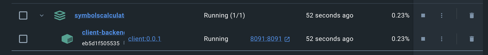

### Тестовое задание 
#### на позицию Java-разработчик (Стажер) в Т1 Консалтинг

Спроектировать(продумать формат и ограничения входящих/исходящих параметров) и реализовать REST API, вычисляющее частоту встречи символов по заданной строке. Результат должен быть отсортирован по убыванию количества вхождений символа в заданную строку.

Пример входной строки: “aaaaabcccc”
Пример выходного результата: “a”: 5, “c”: 4, “b”: 1

Требования к решению:
1) Java 8+
2) Spring boot 2+
3) Решение должно быть покрыто тестами
4) У решения должна быть документация по запуску и формату
   входящих/исходящих параметров
5) Код решения необходимо разместить в публичном Github репозитории.


### Функционал: 
#### реализован один эндпоинт для вычисления частоты встречи символов в строке 

Базовый URL:
```uri
GET localhost:8091/symbols/calculate 
```
Строка, из которой вычисляется количество вхождений символа передаётся в строке запроса в качестве параметра в формате 
```uri
  ?line=ффqweeyy11иииитп1
  ```
Ответ:
```http
200 OK
```
```json
{
    "и": 4,
    "1": 3,
    "ф": 2,
    "e": 2,
    "y": 2,
    "q": 1,
    "т": 1,
    "w": 1,
    "п": 1
}
```
Ограничения входных данных:
* длина строки от 1 до 100 символов
* строка может содержать буквы английского, русского алфавитов в любом регистре
* строка может содержать цифры и символы [!$*().,:;<>]

### Инструкция по запуску и использованию
* скачать директорию с программой
* запустить Docker
* перейти в директорию с программой
* выполнить консольную команду ``` docker-compose up ```
* если docker успешно выполнит все шаги, будет поднят контейнер
<p>

</p>
